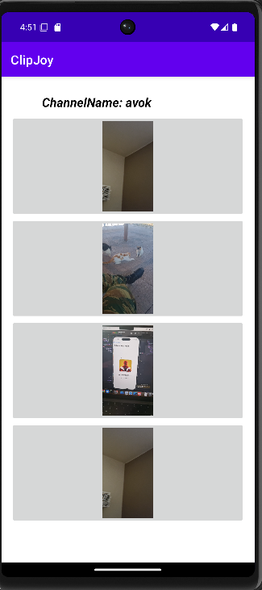

# ClipJoy

ClipJoy is a simple video-sharing application created for users to publish their own short videos on their channels using their respective channel names 
and post videos with hashtags of their choosing. The backend of the project handles communication between publishers/consumers (users) and brokers (servers) using `ServerSockets` 
and appropriate message protocols using push and pull. Additionally, users can remove videos, which they no longer wish to keep posted simply by typing the video name. 
Users(as consumers) can also subscribe to other content creators(publishers) by typing their channel name or subscribe to topics of their preference by typing a hashtag they like. By doing that, they will be informed by pop up messages when a new video is posted.

## Publisher Options:
1. **Set a name for your Channel:** Select "Set a name to your channel".
2. **Upload a Video:** Select "Upload a new video to your channel" and add hashtags for it.
3. **Delete a Video:** Select "Delete a video from your channel" and type the video name.
4. **Record a Video:** Select "Record" to capture a new video from your phone.

## Consumer Options:
1. **Watch Videos by Channel:** Select "Videos by channelname" to view videos from a specific channel.
2. **Watch Videos by Hashtag:** Select "Videos by hashtag" to view videos with a specific hashtag.
3. **Subscribe to a Channel:** Select "subscribe to a channelname" to follow a content creator.
4. **Subscribe to a Hashtag:** Select "Subscribe to a hashtag" to follow a topic of interest.

## Screenshots

Here are some screenshots of ClipJoy in action:

## Menu
    

## Publisher
   

## Consumer
   

## Setup Instructions

The goal is to run your mobile phone as a Publisher, where it uploads videos from its collection or records them, changes the channel name, and deletes its videos. Then proceed to run the emulator as a consumer, where it requests videos by writing the desired channel name or choosing to write the desired hashtag (we see the channelName and hashtag as separate entities). When the Consumer requests videos in one of the two ways, the correct Broker (found by `BrokerMainInfo` via consistent hashing) communicates with the Publisher that has either the channelName or the hashtag and retrieves any videos related to it. First, start the 4 brokers in IntelliJ, then start ClipJoy on the mobile and perform actions as Publisher, and finally, start the emulator as Consumer. Below are the appropriate modifications required to run ClipJoy. Note: It is possible for the app to run even on two different phones, but proper changes need to happen in our files for it to work.

### Running the Back-End in IntelliJ

1. **Set Source Folder:**
   - Navigate to `File -> Project Structure -> Modules`.
   - Ensure that only `src` is set as the source folder.

2. **Run Configurations:**
   - Navigate to `Run -> Edit Configurations`.
   - Press the `+` symbol, choose `Application`, and then set the following:
     - **BrokerMain1**: Takes the port `1001` as an argument and browse to select `Distributed_Project.BrokerMain`.
     - **BrokerMain2**: Takes port `1002`as an argument and browse to select `Distributed_Project.BrokerMain`..
     - **BrokerMain3**: Takes port `1003`as an argument and browse to select `Distributed_Project.BrokerMain`..
     - **BrokerMainInfo**: Takes port `1004`as an argument and browse to select `Distributed_Project.BrokerMain`. 
	 - **PublisherMain1**: Takes port `2001`as an argument and browse to select `Distributed_Project.PublisherMain`.
     - **PublisherMain2**: Takes port `2002`as an argument and browse to select `Distributed_Project.PublisherMain`.
     - **PublisherMain3**: Takes port `2003`as an argument and browse to select `Distributed_Project.PublisherMain`.
	 
     **Note:**PublisherMain is for test purposes so dont run it, but be sure to have these arguments!
     - **ConsumerMain**: Takes the path of a folder of your choosing as an argument (e.g., `C:\Users\Christos\Consumer\`) where you want to save the videos being published, and browse to select `ConsumerMain`.
     - Optionally, you can create `ConsumerMain2` with another path if needed.
	 
	 **Note:**ConsumerMain is for test purposes so dont run it, no need to have these arguments too!
	 
3. **Configure IP Addresses:**
   - In `Variables.java`, set the correct IPs of the Brokers, found via the `ipconfig` command in cmd.
   - Change `BROKER_IP_1`, `BROKER_IP_2`, and `BROKER_IP_3` to your IPv4 address (e.g., `192.168.1.13`).
   - Set `PUBLISHER_IP_1` to the IP address of your mobile after making the IP settings static (e.g., `192.168.1.12`).
  
4. **Run brokers:**
   - Navigate to `Run -> Run..` and start running BrokerMain1, BrokerMain2, BrokerMain3 and BrokerMainInfo, they will be ready to communicate with consumers and publishers for any message.
     

   **Note:** Ignore `PublisherMain` and `ConsumerMain`(no need to run them), as they were used only to test the app before building the front-end on Android Studio.

### Running the Front-End in Android Studio

1. **Configure IP Addresses:**
   - In `Variables.java`, set the correct IPs of the Brokers, found via the `ipconfig` command in cmd.
   - Change `BROKER_IP_11`, `BROKER_IP_22`, and `BROKER_IP_33` to your IPv4 address (e.g., `192.168.1.13`).
   - Set `PUBLISHER_IP_2` to the IP address of your mobile after making the IP settings static (e.g., `192.168.1.12`).
   - Keep `PUBLISHER_IP_1` with the IP `10.0.2.2` (emulator) as we will use it as a Consumer.
  
2. **Build Project and run it on your phone:**
   - Connect your android phone with a usb cable and press the green run button on the navigation bar of Android studio to run it.
   - Remember act only as publisher on your phone, set name and upload videos with hashtags to begin. 
3. **Set an emulator and run it:**
   - Install an emulator in case you dont already have one(e.g., Pixel6 Api 35) and press the green run button to run the app using it.
   - Remember to only act as Consumer, request videos based on channelname or hashtag and subscribe on them if you like to be informed for new videos.

### Communication Flow

1. **Connection Establishment:**
   - When a broker node receives a query from the user, it first checks if the user is already connected (i.e., if the consumer node has registered with that particular broker).
   - If there is an existing connection, the user is allowed to request and pull videos related to a specific channel name or hashtag.
   - If not, a new connection is established, and the consumer is returned a list of other brokers and the keys for which they are responsible.

2. **Request Handling:**
   - When the channel or hashtag is found, the broker appropriately sends the videos to the consumer.
   - If the requested content does not exist, an appropriate message is returned, informing the user and suggesting they search for another available option.
   - Each broker forwards the data for the specific range of channels and hashtags they are responsible for.

3. **Video Playback:**
   - When the consumer receives the information, they appropriately reproduce it using `mediaDataRetriever`[video chunks]

### Note:
Ensure that your mobile IP settings are static, and make the necessary IP address changes in the `Variables.java` class for both IntelliJ and Android Studio configurations.
